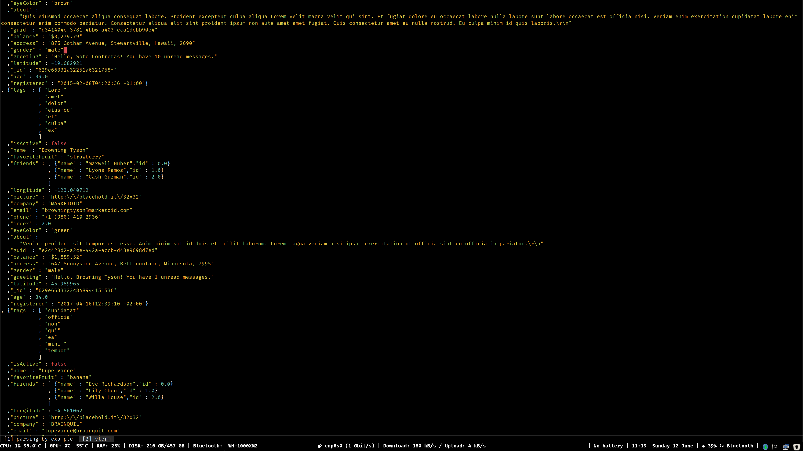

# parsing-by-example [](https://github.com/monadplus/parsing-by-example/actions/workflows/ci.yaml)

This project explores different methods and libraries for parsing CFGs in Haskell.

## JSON: Earley & megaparsec

This example includes lexing with [megaparsec](https://hackage.haskell.org/package/megaparsec) and parsing with [Earley](https://hackage.haskell.org/package/Earley).

Sources at [./src/JSON](./src/JSON).

Running the example:

```bash
cabal run json -- --file examples/random.json
cabal run json -- --file examples/random.json --output random.json
```

Running the property-based tests:

``` sh
cabal run tasty
```

Running the doctests:

```bash
# Sometimes you need to add `tests: True` to `cabal.project.local`
cabal run doctest
```


